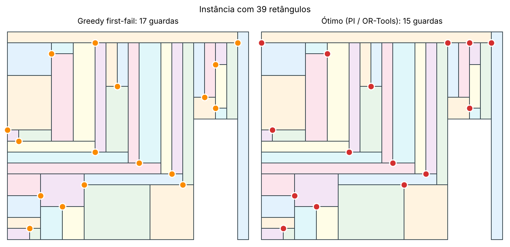
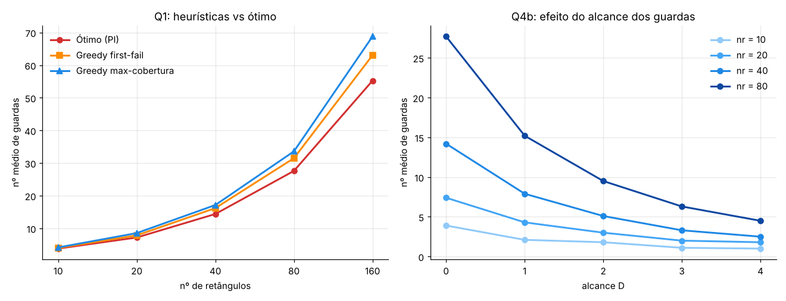

# Vigilância de Partições Retangulares 🛡️

> Qual é o número mínimo de guardas, colocados nos vértices de uma partição retangular, necessário para vigiar todos os retângulos?
> Este projeto ataca o problema com algoritmos *greedy*, Programação Inteira, Programação por Restrições (MAC, CP-SAT e Prolog clpfd) e Programação Dinâmica, e estuda duas extensões: guardas com cores e guardas com maior alcance.


Projeto prático de **Métodos de Apoio à Decisão (MAD, CC3003)** — Licenciatura em Ciência de Computadores, Faculdade de Ciências da Universidade do Porto (2025/26).

📄 **[Relatório completo (PDF)](relatorio.pdf)**

<p align="center">
  
</p>

---

## Índice

- [O problema](#o-problema)
- [Abordagens](#abordagens)
- [Resultados](#resultados)
- [Como executar](#como-executar)
- [Estrutura do repositório](#estrutura-do-repositório)
- [Autores](#autores)

## O problema

Dada uma partição $\Pi$ de um retângulo em retângulos menores, coloca-se um guarda num vértice $p$. Esse guarda vigia todos os retângulos que têm $p$ como vértice. O objetivo é escolher um conjunto mínimo de vértices $S$ tal que todos os retângulos fiquem vigiados.

Notação usada em todo o código:

| Símbolo | Significado |
|---|---|
| $R$ | retângulos a cobrir |
| $P$ | vértices candidatos a posto de guarda |
| $G[r]$ | vértices que veem o retângulo $r$ |
| $V[p]$ | retângulos vistos a partir do vértice $p$ (inversa de $G$) |
| $S \subseteq P$ | conjunto de guardas escolhido (a solução) |

**Pré-processamento comum a todas as abordagens:**

1. Leitura do formato produzido pelo gerador `rectParts.c`.
2. Identificação do retângulo exterior.
3. Remoção dos vértices da borda externa da lista de candidatos. Para qualquer solução ótima, um guarda na borda pode sempre ser trocado por um vizinho interior equivalente.

O problema é um caso particular de **Set Cover**:

$$
\min \sum_{p \in P} x_p \quad \text{s.a.} \quad \sum_{p \in G[r]} x_p \ge 1 \;\; \forall r \in R, \qquad x_p \in \{0,1\}
$$

## Abordagens

| Questão | Técnica | Ficheiros |
|---|---|---|
| **Q1** | Duas heurísticas *greedy*: **first-fail** (atacar primeiro o retângulo com menos candidatos) e **max-cobertura** (escolher o vértice que cobre mais retângulos por cobrir). Ambas são comparadas com o ótimo. | [`programas/Q1/`](programas/Q1) |
| **Q2** | Modelo de **Programação Inteira** / CSP, resolvido de três formas: (a) *backtracking* próprio com **MAC (AC-3) + Branch & Bound**; (b) **Google OR-Tools CP-SAT**; (c) **SWI-Prolog clpfd**. | [`programas/Q2/`](programas/Q2) |
| **Q3** | **Programação Dinâmica** com *bitmask* e memoização, mais uma análise de porque a PD de perfil não escala em partições 2D ($\mathcal{O}(2^W)$ estados). | [`programas/Q3/`](programas/Q3) |
| **Q4a** | **Guardas com cores**: dois guardas que veem o mesmo retângulo não podem ter a mesma cor (`all_distinct`). Duas leituras do enunciado: **A** (fixar a solução ótima e depois colorir) e **B** (otimização lexicográfica: mínimo de guardas e, entre essas soluções, mínimo de cores). | [`programas/Q4/cores.py`](programas/Q4/cores.py) |
| **Q4b** | **Guardas com alcance $D$**: um guarda vê também os retângulos a distância $\le D$ no grafo de vértices da partição. Os conjuntos $V_D[p]$ são calculados com **BFS limitado**. | [`programas/Q4/alcance.py`](programas/Q4/alcance.py) |

## Resultados

<p align="center">
  
</p>

**Q1: heurísticas vs ótimo** (20 instâncias por tamanho)

| nr | ótimo | first-fail | excesso | max-cobertura | excesso | tempo PI |
|---:|---:|---:|---:|---:|---:|---:|
| 10 | 3,80 | 4,00 | 6,3 % | 4,15 | 10,0 % | 4,6 ms |
| 20 | 7,20 | 7,85 | 9,3 % | 8,55 | 18,9 % | 5,5 ms |
| 40 | 14,40 | 16,20 | 12,7 % | 17,15 | 19,3 % | 13,5 ms |
| 80 | 27,60 | 31,50 | 14,1 % | 33,60 | 21,8 % | 24,4 ms |
| 160 | 55,25 | 63,05 | 14,2 % | 68,80 | 24,5 % | 102,0 ms |

**Principais conclusões:**

- **First-fail é melhor que max-cobertura em todos os tamanhos.** O excesso estabiliza em cerca de 14 % contra cerca de 24 %. A max-cobertura é a heurística clássica de Set Cover, mas ignora a geometria e deixa para o fim retângulos com poucos candidatos.
- **O solver exato é rápido.** Resolve instâncias com 160 retângulos em cerca de 100 ms, por isso as heurísticas servem sobretudo como termo de comparação.
- **Q2.** MAC, CP-SAT e clpfd chegam sempre ao mesmo custo ótimo, muitas vezes com colocações diferentes, porque há várias soluções ótimas simétricas.
- **Q4a.** Para o número mínimo de guardas bastam tipicamente 1 ou 2 cores. A leitura lexicográfica (B) dá em média cerca de 1,5 cores, contra cerca de 2,1 na leitura A.
- **Q4b.** Com $D = 1$ o número de guardas cai quase para metade (com 80 retângulos, de 27,7 para 15,2). Com $D = 0$ recupera-se exatamente o problema base, o que valida a extensão.

Todos os detalhes, modelos e discussão estão no **[relatório](relatorio.pdf)**.

## Como executar

### Requisitos

- Python ≥ 3.8 e **Google OR-Tools**:
  ```bash
  pip install -r requirements.txt
  ```
- **SWI-Prolog**, opcional, só para a versão clpfd da Q2.
- Um compilador de **C**, opcional, só para gerar novas instâncias.

### Gerar instâncias (opcional)

A pasta [`casos_teste/`](casos_teste) já tem instâncias com 10, 20, 40 e 80 retângulos. Para gerar outras:

```bash
cd programas
gcc rectParts.c -o gerador -lm
echo "40 20" | ./gerador inst.txt      # 20 instâncias de 40 retângulos
```

### Correr cada questão

Todos os scripts aceitam um ficheiro de instâncias ou uma pasta (por omissão, `../../casos_teste/`).

```bash
# Q1: heurísticas greedy e solver exato
cd programas/Q1
python3 greedy.py    ../../casos_teste/inst_10.txt
python3 exato.py     ../../casos_teste/inst_10.txt
python3 benchmark.py ../../casos_teste           # tabela greedy vs ótimo (+ CSV)

# Q2: MAC, CP-SAT e Prolog
cd ../Q2
python3 ex2B_MAC_AC3.py ../../casos_teste/inst_10.txt
python3 ex2C_ORTools.py ../../casos_teste/inst_10.txt
swipl -s ex2C_prolog.pl

# Q3: programação dinâmica
cd ../Q3
python3 ex3_DP.py ../../casos_teste/inst_10.txt

# Q4: extensões
cd ../Q4
python3 cores.py         ../../casos_teste/inst_10.txt   # Q4a: Leituras A e B
python3 alcance.py       ../../casos_teste/inst_10.txt   # Q4b: alcance D
python3 bench_cores.py   ../../casos_teste
python3 bench_alcance.py ../../casos_teste
```

Exemplo de saída (`benchmark.py`):

```
  nr | #inst | opt_med opt_max |  ff_med ff_max  ff %ot  ff exc% |  mc_med mc_max  mc %ot  mc exc% |  t_opt ms
--------------------------------------------------------------------------------------------------------------
  10 |     5 |    3.80       4 |    4.20      5   60.0%   11.67% |    4.40      5   40.0%   16.67% |       8.6
  20 |     5 |    7.00       7 |    8.00      9   20.0%   14.29% |    7.80      8   20.0%   11.43% |       8.1
  40 |     5 |   14.00      15 |   15.20     17   20.0%    8.38% |   17.00     18    0.0%   21.58% |      16.4
  80 |     5 |   28.20      29 |   32.20     34    0.0%   14.30% |   34.00     35    0.0%   20.77% |      40.3
```

O solver lexicográfico da Q4a (`cores.py`) tem um limite de 60 s por instância. A coluna `otimo? = True` indica um ótimo provado.

## Estrutura do repositório

```
.
├── relatorio.pdf / relatorio.tex   # relatório completo
├── casos_teste/                    # instâncias pré-geradas (10, 20, 40, 80 retângulos)
├── docs/                           # figuras deste README
└── programas/
    ├── rectParts.c, types.h, macros.h   # gerador de instâncias (fornecido)
    ├── Q1/   instance.py · greedy.py · exato.py · benchmark.py
    ├── Q2/   ex2A.md (modelo) · ex2B_MAC_AC3.py · ex2C_ORTools.py · ex2C_prolog.pl
    ├── Q3/   ex3.md (análise) · ex3_DP.py
    └── Q4/   instance_q4.py · cores.py · alcance.py · bench_*.py
```

## Autores

**Grupo 06**

- Cauã Pinheiro Souza
- Matheus Gonçalves Guerra

O gerador de instâncias (`rectParts.c`) foi fornecido pela equipa docente da unidade curricular.
